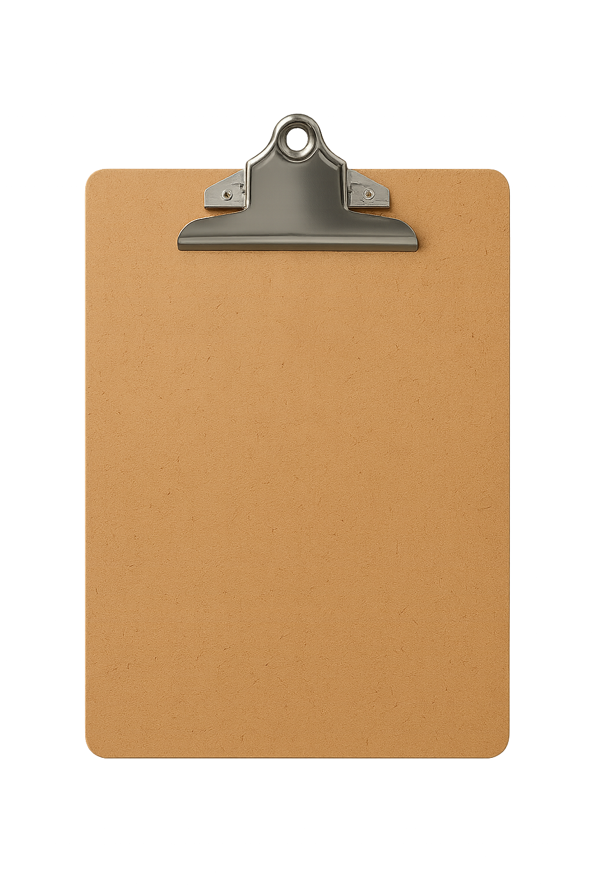

# ClipShare 📋

**Share clipboard content seamlessly between your Windows PC and smartphone on the same network — no QR size limits, no extra apps required.**

<div align="center">

<br>


[](https://www.google.com/chrome/)
[](https://brave.com/)
[](https://www.python.org/)
[](LICENSE)

</div>

---

## ✨ Features

- 🚀 **Local Web Server** - No cloud, no third-party services, just your local network
- 📱 **Phone-to-PC & PC-to-Phone** - Bidirectional clipboard sharing
- 🎨 **Modern Glass UI** - Beautiful glassmorphism design with dark mode support
- 👁️ **Customizable Interface** - Hide/show sections as needed
- 🔒 **Privacy First** - Everything stays on your local network
- ⚡ **Fast & Lightweight** - No heavy dependencies
- 🌐 **Universal Phone Support** - Any device with a browser works
- 💾 **No Size Limits** - Share large text content without restrictions

---

## 📸 Screenshots

### Extension Popup
Modern glass effect design with quick clipboard controls and QR code.


### Phone Interface
Clean, responsive web interface that works on any smartphone browser.


---

## 🚀 Quick Start

### Prerequisites

- **Windows PC** (Windows 10/11)
- **Python 3.8+** installed
- **Chrome** or **Brave** browser
- **Smartphone** on the same WiFi network

### Installation

#### 1. Clone the Repository

```bash
git clone https://github.com/yourusername/clipshare.git
cd clipshare
```

#### 2. Install Python Dependencies

```bash
cd native-host
pip install -r requirements.txt
```

#### 3. Install Native Host (Windows)

Run the installation script as Administrator:

```bash
install_windows.bat
```

This will:
- Register the native messaging host
- Set up the Chrome/Brave extension communication bridge

#### 4. Load the Extension

**Chrome/Brave:**
1. Open `chrome://extensions/` (or `brave://extensions/`)
2. Enable **Developer mode** (top right)
3. Click **Load unpacked**
4. Select the `clipshare` folder
5. The ClipShare icon should appear in your toolbar

---

## 📖 How to Use

### Step 1: Start the Server

1. Click the **ClipShare** extension icon
2. Click **▶️ Start** button
3. Server starts on your local network (typically `http://192.168.x.x:8080`)

### Step 2: Connect Your Phone

**Option A: Scan QR Code**
1. QR code appears in the popup
2. Scan it with your phone's camera
3. Opens the web interface in your phone's browser

**Option B: Open in Window**
1. Click **🪟 Window** button
2. Copy the URL and send it to your phone
3. Or click **📋 Copy** and paste in phone browser

### Step 3: Share Clipboard

**From PC to Phone (Quick Method):**
1. Type or paste text in the **Quick Clipboard** textarea
2. Click **⬆️ Send**
3. On your phone, click **⬇️ Receive**

**From Phone to PC:**
1. On your phone, type or paste text
2. Click **⬆️ Send**
3. In the extension popup, click **⬇️ Receive**

**Direct Clipboard Sync:**
- The extension can read/write your PC clipboard
- Phone interface reads/writes PC clipboard through the server
- Seamless bidirectional sync

### Step 4: Stop the Server

Click **⏹️ Stop** when done to shut down the server.

---

## 🎛️ Interface Features

### Extension Popup

- **Glass Effect Design** - Modern frosted glass appearance
- **Auto Dark Mode** - Follows your system theme
- **Status Indicator** - Green when online, red when offline
- **Quick Clipboard** - Send/receive without opening browser
- **QR Code** - Quick phone connection
- **Hide Buttons** - Minimize sections you don't need

### Phone Interface

- **Clean Design** - Minimal, responsive layout
- **Auto Theme** - Matches your phone's dark/light mode
- **Simple Controls** - Just Receive and Send buttons
- **Status Messages** - Clear feedback on actions

---

## 🛠️ Configuration

### Change Server Port

Edit `native-host/clipshare_host.py`:

```python
PORT = 8080  # Change to your preferred port
```

### Customize Extension

The extension files are easy to modify:
- `popup.html` - UI structure and styling
- `popup.js` - Extension logic
- `manifest.json` - Extension metadata

---

## 🔧 Troubleshooting

### "Native host error" message

**Solution:**
1. Make sure you ran `install_windows.bat` as Administrator
2. Close and reopen Chrome/Brave
3. Try reloading the extension

### Server won't start

**Check:**
- Python is installed: `python --version`
- Dependencies installed: `pip show pyperclip`
- Port 8080 is not in use by another program

### Phone can't connect

**Verify:**
- Phone and PC are on the same WiFi network
- Firewall isn't blocking port 8080
- Try accessing the URL directly in phone browser

### "Failed" when sending clipboard

**Solution:**
- Stop the server (click ⏹️ Stop)
- Wait 2 seconds
- Start it again (click ▶️ Start)
- The CORS fix requires a fresh server restart

---

## 🗂️ Project Structure

```
clipshare/
├── manifest.json          # Chrome extension manifest
├── popup.html             # Extension popup UI
├── popup.js               # Extension logic
├── background.js          # Service worker
├── qrcode.min.js          # QR code generation library
├── icon.png               # Extension icon
├── native-host/
│   ├── clipshare_host.py         # Python HTTP server
│   ├── clipshare_host.bat        # Windows launcher
│   ├── com.clipshare.host.json   # Native messaging manifest
│   ├── requirements.txt          # Python dependencies
│   ├── install_windows.bat       # Installation script
│   └── uninstall_windows.bat     # Uninstallation script
└── README.md              # This file
```

---

## 🔐 Privacy & Security

- ✅ **No cloud services** - Everything runs locally
- ✅ **No data collection** - Zero telemetry or tracking
- ✅ **Local network only** - Server binds to your LAN IP
- ✅ **No external dependencies** - Self-contained solution
- ⚠️ **Local network security** - Anyone on your WiFi can access the server while running
- 💡 **Recommendation** - Only run when needed, stop when done

---

## 🤝 Contributing

Contributions are welcome! Here's how you can help:

1. **Fork** the repository
2. **Create** a feature branch (`git checkout -b feature/amazing-feature`)
3. **Commit** your changes (`git commit -m 'Add amazing feature'`)
4. **Push** to the branch (`git push origin feature/amazing-feature`)
5. **Open** a Pull Request

### Development Setup

```bash
# Clone your fork
git clone https://github.com/yourusername/clipshare.git
cd clipshare

# Install dependencies
cd native-host
pip install -r requirements.txt

# Make changes and test
# Load the extension in Chrome with "Load unpacked"
```

---

## 🐛 Known Issues

- Server must be restarted after code changes
- QR code regeneration on every start (minor delay)
- Windows-only native host (Linux/Mac support coming soon)

---

## 📝 TODO / Roadmap

- [ ] Linux and macOS support
- [ ] File sharing capability
- [ ] Clipboard history
- [ ] Multiple device support
- [ ] Encrypted connections (HTTPS)
- [ ] Browser notification on clipboard update
- [ ] Chrome Web Store publication

---

## 📄 License

This project is licensed under the **MIT License** - see the [LICENSE](LICENSE) file for details.

---

## 👨‍💻 Author

Created with ❤️ by [Your Name]

---

## 🙏 Acknowledgments

- [QRCode.js](https://davidshimjs.github.io/qrcodejs/) - QR code generation
- [Pyperclip](https://github.com/asweigart/pyperclip) - Cross-platform clipboard access
- Chrome Extension documentation

---

## 📞 Support

Having issues? Here's how to get help:

1. Check the [Troubleshooting](#-troubleshooting) section
2. Search [existing issues](https://github.com/yourusername/clipshare/issues)
3. Open a [new issue](https://github.com/yourusername/clipshare/issues/new) with:
   - Your OS version
   - Python version
   - Browser version
   - Error messages or screenshots

---

## ⭐ Show Your Support

If you found this project helpful, please consider:
- ⭐ **Starring** the repository
- 🐛 **Reporting** bugs
- 💡 **Suggesting** new features
- 🔀 **Contributing** code

---

<div align="center">

**Made with Python, JavaScript, and a lot of ☕**

[Report Bug](https://github.com/yourusername/clipshare/issues) · [Request Feature](https://github.com/yourusername/clipshare/issues)

</div>
